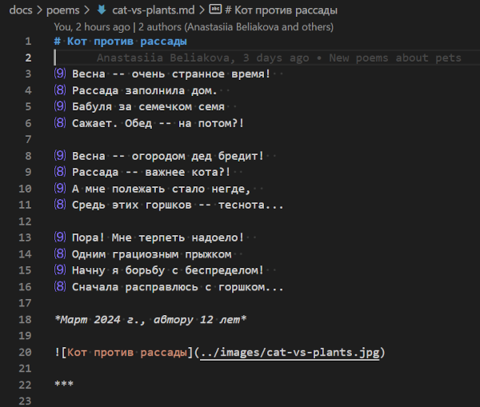

# Verse Helper

Это расширение посчитывает количество слогов в стихотворных строках.

Поддерживаются Markdown-файлы со стихами на *русском* языке.

Количество слогов отображается в редакторе слева от каждой строки.

Требования к форматированию стихов:

1. Каждая строфа (например, четверостишие) является абзацем.
   Для этого, последняя строка каждой строфы заканчивается двойным переводом строки в Markdown.

2. Строки, кроме последней в строфе, должны оканчиваться [двойным пробелом в Markdown](https://spec.commonmark.org/0.30/#hard-line-breaks)
   (что соответствует ` ` в HTML).

***

Based on: https://github.com/microsoft/vscode-extension-samples/tree/main/decorator-sample
